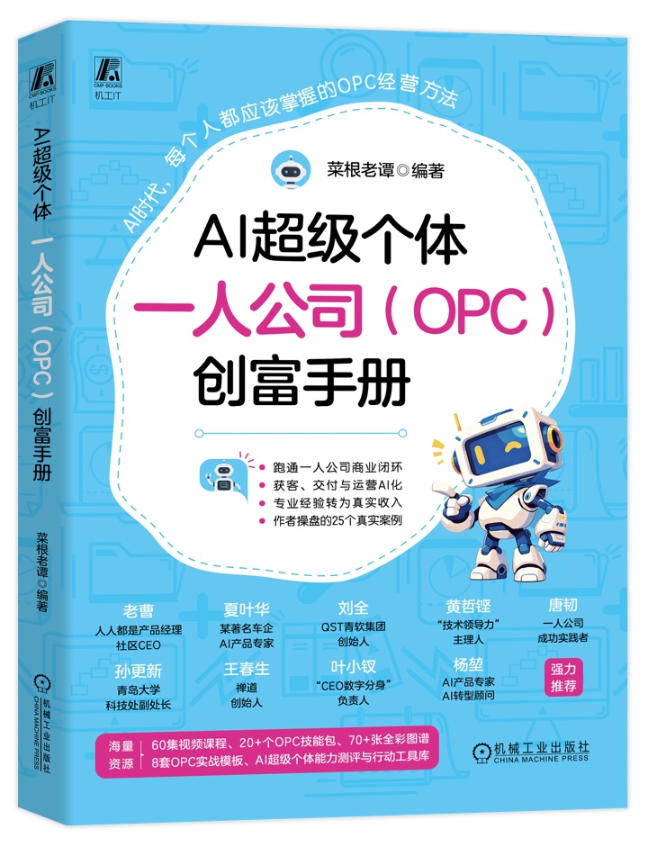

# 《AI超级个体》一人公司（OPC）实战 Skills

> 把书中的方法、清单和案例，变成可以直接与 AI 对话执行的工作流。

<p align="center">
  
</p>

本仓库是菜根老谭编著的《AI超级个体：一人公司（OPC）创富手册》（机械工业出版社，ISBN 978-7-111-81776-5）的配套 Skills 集合。

全书讲解如何识别个人优势、定位可交付产品，并借助 AI 完成获客、销售、交付、运营与增长；本仓库则把其中的关键方法封装成 **21 个可复用的 AI Skills**。你可以把它们当作一套随书行动工具：边读、边问、边做，让知识最终落到一次真实访谈、一份报价、一个 MVP 或一套可运行的业务流程上。

机器或安装器可通过 [`catalog.json`](catalog.json) 获取版本、书籍信息、技能名称、阶段和路径。

GitHub：[`cglt2026opc/opc-skills`](https://github.com/cglt2026opc/opc-skills)

## 这套 Skills 能帮你做什么

- 看清职业风险、能力结构与 AI 杠杆，找到下一步行动重点。
- 把专业经验变成明确、可验证、可收费的产品或服务。
- 完成一人公司的定位、商业模式、需求验证与价值定价。
- 建立个人品牌、内容获客、标准交付与 AI 虚拟团队。
- 用季度和年度计划持续复盘，让业务从偶然收入走向稳定闭环。

Skills 不会替你虚构市场需求或跳过真实验证。涉及客户需求、价格、合同、竞业、税务、医疗、法律和财务等重要判断时，请用真实证据和专业意见复核。

## 从哪里开始

如果你暂时不知道该选哪个 Skill，可以直接从下面三条路线开始。

### 路线一：从职业焦虑到升级行动

`career-diagnostic` → `super-individual-assessment` → `ability-upgrade` → `super-individual-90day`

适合正在评估 AI 替代风险、寻找转型方向，或希望制定 90 天能力升级计划的读者。

### 路线二：从专业能力到第一笔收入

`capability-productizer` → `opc-positioner` → `opc-startup-readiness` → `mvp-validator` → `value-pricer`

适合已经有一项专业能力，希望把“偶尔帮人”变成可销售产品，并用真实付费完成验证的读者。

### 路线三：从单次交付到一人公司闭环

`opc-modeler` → `personal-brand-builder` → `content-planner` → `sop-generator` → `ai-team-builder` → `growth-tracker`

适合已经开始接单，希望打通定位、获客、交付、运营与增长流程的实践者。

`case-explorer`、`resource-explorer` 和 `opc-prompt-workbench` 可以在任何阶段作为案例、工具与提示词工作台使用。

## 21 个配套 Skills

### 1. 觉醒与诊断

| Skill | 用途 | 你可以这样问 |
| --- | --- | --- |
| [`career-diagnostic`](skills/career-diagnostic/) | 评估岗位的 AI 替代风险与职业转型方向 | “评估一下我的岗位安全吗？” |
| [`super-individual-assessment`](skills/super-individual-assessment/) | 按四大支柱完成证据化能力自测 | “我离 AI 超级个体还有多远？” |
| [`dreyfus-ai-assessor`](skills/dreyfus-ai-assessor/) | 用德雷福斯五阶段模型判断一项技能的水平与 AI 风险 | “评估我的产品设计能力在哪一级。” |
| [`case-explorer`](skills/case-explorer/) | 从书中 25 个案例里匹配并拆解最相关案例 | “哪个书中案例最适合我参考？” |

### 2. 能力与定位

| Skill | 用途 | 你可以这样问 |
| --- | --- | --- |
| [`ability-upgrade`](skills/ability-upgrade/) | 训练技术理解、产品思维、业务洞察与推进落地能力 | “帮我从执行者升级为价值操盘手。” |
| [`capability-productizer`](skills/capability-productizer/) | 判断哪些能力适合产品化，并设计首个付费实验 | “我会这些技能，哪一个最值得先卖？” |
| [`opc-positioner`](skills/opc-positioner/) | 基于能力与市场完成一人公司差异化定位 | “帮我找到适合的一人公司方向。” |
| [`personal-brand-builder`](skills/personal-brand-builder/) | 从真实成果中提炼人设和个人品牌 | “怎样让目标客户更容易记住我？” |

### 3. 产品与商业验证

| Skill | 用途 | 你可以这样问 |
| --- | --- | --- |
| [`opc-modeler`](skills/opc-modeler/) | 梳理一人公司商业模式画布的 9 个要素 | “为我的咨询业务做一张 OPC 商业画布。” |
| [`kano-prioritizer`](skills/kano-prioritizer/) | 用 KANO 框架分类需求并安排产品优先级 | “这 8 个功能应该先做哪几个？” |
| [`mvp-validator`](skills/mvp-validator/) | 设计真实客户、真实交付、真实付费的最小实验 | “帮我用 14 天验证这个课程想法。” |
| [`value-pricer`](skills/value-pricer/) | 按客户价值设计三档报价与沟通话术 | “为这项服务设计基础、标准和高阶报价。” |
| [`opc-startup-readiness`](skills/opc-startup-readiness/) | 用 12 项清单评估副业启动或全职创业准备度 | “我现在适合启动一人公司吗？” |
| [`side-income-launcher`](skills/side-income-launcher/) | 在职期间低风险完成第一次副业变现 | “怎样把经常帮人的事变成第一笔收入？” |

### 4. 获客、交付与运营

| Skill | 用途 | 你可以这样问 |
| --- | --- | --- |
| [`content-planner`](skills/content-planner/) | 规划公众号、视频号、小红书、抖音等内容矩阵 | “围绕我的定位做一个月内容计划。” |
| [`sop-generator`](skills/sop-generator/) | 把重复工作变成可执行、可检查、可交接的 SOP | “把客户入驻流程整理成 SOP。” |
| [`ai-team-builder`](skills/ai-team-builder/) | 按业务流程配置 AI 虚拟团队和工具组合 | “为我的一人咨询公司搭一支 AI 团队。” |
| [`opc-prompt-workbench`](skills/opc-prompt-workbench/) | 定制书中 16 个高频场景的可执行提示词 | “给我一份用于客户需求分析的提示词。” |
| [`resource-explorer`](skills/resource-explorer/) | 按业务阶段、预算和任务选择最小工具组合 | “我在刚起步阶段，应该先用哪些 AI 工具？” |

### 5. 行动与增长

| Skill | 用途 | 你可以这样问 |
| --- | --- | --- |
| [`super-individual-90day`](skills/super-individual-90day/) | 把目标拆成每周可执行的 90 天行动计划 | “从今天起给我制定一份 90 天计划。” |
| [`growth-tracker`](skills/growth-tracker/) | 制定和复盘收入、渠道、合作与季度增长计划 | “帮我制定一人公司的年度增长计划。” |

## 安装

`skills/` 中的每个子目录都是一个独立 Skill，可以只安装需要的几个，也可以安装全部。

本仓库同时支持 Codex、Cursor、Gemini CLI、GitHub Copilot、OpenClaw、Hermes Agent、WorkBuddy 和千问办公；豆包办公通过提示词兼容包使用。各平台的支持级别、安装路径与限制见[智能体兼容与安装指南](docs/AGENT-COMPATIBILITY.md)。

### 跨智能体快速安装

使用仓库内的统一工具，可以安装全部 Skill，也可以通过重复传入 `--skill` 只选择需要的几个：

```bash
# OpenClaw
python3 scripts/opc_skills.py install --agent openclaw

# Hermes Agent
python3 scripts/opc_skills.py install --agent hermes

# 千问办公 / QwenWork
python3 scripts/opc_skills.py install --agent qwenwork

# 查看所有可用名称和更多参数
python3 scripts/opc_skills.py list
python3 scripts/opc_skills.py install --help
```

WorkBuddy 使用界面上传的 ZIP 包；豆包办公使用可粘贴的提示词兼容包：

```bash
python3 scripts/opc_skills.py package --agent workbuddy
python3 scripts/opc_skills.py package --agent doubao
```

### 安装单个 Skill

在仓库根目录执行：

```bash
mkdir -p "$HOME/.agents/skills"
cp -R skills/super-individual-assessment "$HOME/.agents/skills/"
```

把 `super-individual-assessment` 替换成其他目录名即可。

### 安装全部 Skills

下面的方式使用符号链接，更新仓库后无需再次复制：

```bash
mkdir -p "$HOME/.agents/skills"

for skill_file in skills/*/SKILL.md; do
  skill_dir="${skill_file%/SKILL.md}"
  target="$HOME/.agents/skills/$(basename "$skill_dir")"
  [ -e "$target" ] || ln -s "$PWD/$skill_dir" "$target"
done
```

Codex 通常会自动识别新增或更新的 Skill；如果没有出现，请重启 Codex。更多格式与加载位置说明见 [OpenAI Skills 官方文档](https://developers.openai.com/codex/skills)。

## 使用

安装后有两种调用方式：

1. **直接描述任务**：例如“帮我评估这个产品想法”，Codex 会根据 Skill 的描述自动选择。
2. **显式指定 Skill**：输入 `$mvp-validator`，再补充你的想法、目标客户和现有证据。

建议尽量提供真实背景，包括目标用户、做过的项目、交付结果、时间预算和约束条件。信息越具体，输出越接近可执行方案。

一个完整示例：

```text
$capability-productizer

我是一名有 8 年经验的供应链经理，每周能投入 8 小时。
过去一年帮两家朋友的公司降低过库存积压，但没有正式收费。
请帮我判断这项能力是否适合产品化，并设计一个 14 天内能完成的付费验证。
```

你也可以继续追问：“把结果整理成行动清单”“指出哪些结论还缺证据”“为第一位访谈对象写邀请话术”。

## 随附资源

部分 Skills 除 `SKILL.md` 外，还包含可直接复用的材料：

- 可填写的 Word / Excel 模板：能力自测、90 天成长、能力产品化、创业准备、日常 SOP、年度增长等。
- 结构化参考数据：25 个书中案例、工具资源导航、KANO 规则、德雷福斯阶段说明等。
- 确定性脚本：用于测评分数、准备度判定、能力筛选和需求排序，减少重复计算误差。
- 书中 16 个高频场景的 Prompt 模板库。

典型目录结构如下：

```text
skill-name/
├── SKILL.md          # 工作流、触发条件与输出要求
├── agents/           # Codex 展示信息
├── references/       # 方法、规则或结构化数据（可选）
├── scripts/          # 确定性计算脚本（可选）
└── assets/           # Word、Excel、图片等配套材料（可选）
```

仓库中的实际路径为 `skills/<skill-name>/`。贡献和本地校验方法见[贡献指南](CONTRIBUTING.md)，安全问题请按[安全说明](SECURITY.md)私下报告。

## 书与 Skills 的配合方式

书负责建立完整认知、解释方法来源并呈现案例；Skills 负责在你的具体情境里追问、计算、整理和生成行动方案。推荐按以下节奏使用：

1. 阅读相关章节，先理解方法和判断标准。
2. 调用对应 Skill，提交自己的真实情况与证据。
3. 把输出带回现实，完成访谈、报价、交付或复盘。
4. 用新的结果再次运行 Skill，迭代下一轮行动。

这套工具的目标不是生成一份看起来完整的答案，而是帮助你跑通“识别优势 → 产品化 → 获客 → 交付 → 运营 → 增长”的一人公司商业闭环。

## 适用范围与反馈

本仓库适合《AI超级个体》的读者，也适合正在探索职业转型、副业验证、个人品牌和一人公司的实践者。核心 Skill 遵循开放的 Agent Skills 目录结构，并通过安装或导出工具适配不同智能体；平台专属字段、工具权限和办公文件能力以各产品实际版本为准。

如果你发现方法与书中表述不一致、示例不够清楚或流程无法执行，欢迎提交 Issue 或 Pull Request，并注明 Skill 名称、使用场景、输入摘要和预期结果。请勿提交客户隐私、合同原文、账号密钥或其他敏感信息。

## 许可证

Agent Skill 指令、脚本和仓库文档采用 [MIT License](LICENSE)。书籍封面以及 `skills/*/assets/` 下的 Word、Excel、图片等配套素材不在 MIT 授权范围内，版权归相应权利人所有，具体边界见许可证文件。

---

《AI超级个体：一人公司（OPC）创富手册》｜菜根老谭 编著｜机械工业出版社
