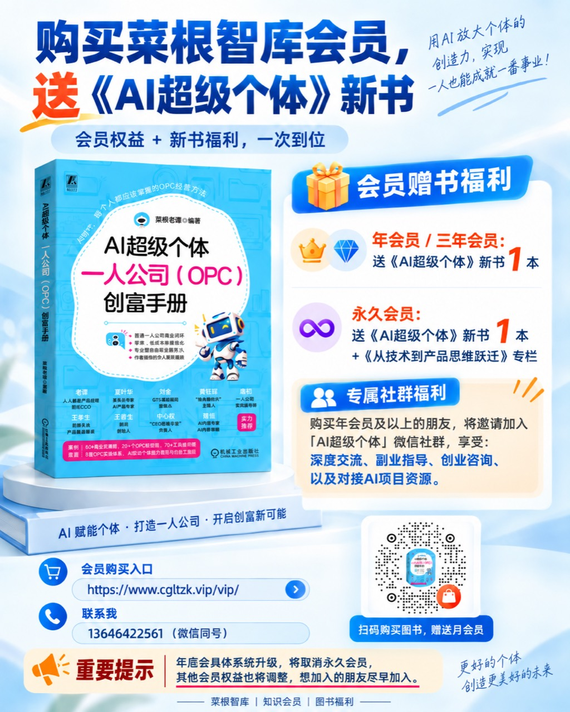

# 《AI超级个体》一人公司（OPC）实战 Skills

> 把书中的方法、清单和案例，变成可以直接与 AI 对话执行的工作流。

<p align="center">
  
</p>

本仓库是菜根老谭编著的《AI超级个体：一人公司（OPC）创富手册》（机械工业出版社，ISBN 978-7-111-81776-5）的配套 Skills 集合。**新书已正式出版。**

全书讲解如何识别个人优势、定位可交付产品，并借助 AI 完成获客、销售、交付、运营与增长；本仓库则把书中 **“20+ 个 OPC 技能包”集成为一个 AI 超级个体实战助手，内含 21 个可复用模块**。你可以把它们当作一套随书行动工具：边读、边问、边做，让知识最终落到一次真实访谈、一份报价、一个 MVP 或一套可运行的业务流程上。

**默认只安装一个技能：`ai-super-individual`。** 直接说出问题，助手按需选择内部模块；原有 21 个独立包仍可选下载。

机器或安装器可通过 [`catalog.json`](catalog.json) 获取版本、书籍信息、技能名称、阶段和路径。

GitHub：[`cglt2026opc/opc-skills`](https://github.com/cglt2026opc/opc-skills)

本项目也是一套面向职场人、专业人士、自由职业者和一人公司创业者的开源 OPC AI 工作流，**没有购买本书也可以使用**。现在提供“OPC 实战助手 + 菜根智库知识资源入口”，保留书中 21 个模块，新增 1 个知识资源导航模块，共 22 个内部模块。

| 层次 | 载体 | 职责 |
| --- | --- | --- |
| 方法论层 | 《AI超级个体》 | 提供系统方法论 |
| 执行层 | OPC Skills | 帮你完成方案、验证、交付与行动 |
| 知识与资源层 | [菜根智库](https://www.cgltzk.vip) | 提供延伸知识、模板与案例入口 |

## 关于这本书

《AI超级个体：一人公司（OPC）创富手册》是一本帮助职场人、专业人士、自由职业者和转型创业者，把专业能力转化为个人事业的实战指南。

本书从真实工作与生活场景出发，带领读者识别自己的专业优势，找到值得解决的问题，设计可验证、可复用、可持续交付的产品，并借助 AI 完成内容生产、获客、销售、交付与运营，逐步建立属于自己的产品和收入系统。

书中不仅讨论“一人公司是什么”，更关注“今天可以做什么”：通过作者亲自操盘的 25 个真实案例，呈现从能力盘点、价值定位到商业闭环的具体路径，帮助读者少走弯路，把专业经验真正变成市场认可的价值。

## 新书已出版 · 会员赠书福利

[新书专题页](https://www.cgltzk.vip/book/opc.html) · [会员开通入口](https://www.cgltzk.vip/vip/)

以下福利依据作者于 2026-09-21 提供的活动海报整理：

| 会员类型 | 新书及附加福利 |
| --- | --- |
| 年会员 / 三年会员 | 赠送《AI超级个体》新书 1 本 |
| 永久会员 | 赠送《AI超级个体》新书 1 本 +《从技术到产品思维跃迁》专栏 |
| 年会员及以上 | 邀请加入「AI超级个体」微信社群，享深度交流、副业指导、创业咨询及 AI 项目资源对接 |

海报另有“扫码购买图书，赠送月会员”活动；请使用下方海报中的购书二维码，具体领取方式咨询作者。联系：**13646422561（微信同号）**。

海报提示年底会员体系升级，将取消永久会员，其他会员权益也将调整；具体生效日期、在售类型和办理规则以活动页面或客服确认为准。会员福利与开源 Skills 使用相互独立，无需购书或开通会员也可以使用 Skills。

<p align="center">
  
</p>

## 这本书与 Skills 为读者带来的价值

| 载体 | 主要作用 | 读者获得什么 |
| --- | --- | --- |
| **这本书** | 提供完整的 OPC 方法、案例与商业认知 | 建立从专业能力到产品、客户和收入系统的全局框架 |
| **这套 Skills** | 把书中的方法转化为智能体可执行的提问、诊断和行动流程 | 在自己的真实情境中完成分析、选择、验证与复盘 |

三层协同后，读者不只是在“读懂一个方法”，而是在 AI 智能体的陪伴下持续推进自己的项目：明确下一步、产出可检查的证据、及时发现风险，并让每一次行动都沉淀为可复用的个人资产。

## 这套 Skills 能帮你做什么

- 看清职业风险、能力结构与 AI 杠杆，找到下一步行动重点。
- 把专业经验变成明确、可验证、可收费的产品或服务。
- 完成一人公司的定位、商业模式、需求验证与价值定价。
- 建立个人品牌、内容获客、标准交付与 AI 虚拟团队。
- 用季度和年度计划持续复盘，让业务从偶然收入走向稳定闭环。

Skills 不会替你虚构市场需求或跳过真实验证。涉及客户需求、价格、合同、竞业、税务、医疗、法律和财务等重要判断时，请用真实证据和专业意见复核。

## 从哪里开始

默认使用统一助手，不需要挑选技能。下面三条路线展示内部模块如何衔接，也方便按书中名称查找。

### 路线一：从职业焦虑到升级行动

`career-diagnostic` → `super-individual-assessment` → `ability-upgrade` → `super-individual-90day`

适合正在评估 AI 替代风险、寻找转型方向，或希望制定 90 天能力升级计划的读者。

### 路线二：从专业能力到第一笔收入

`capability-productizer` → `opc-positioner` → `opc-startup-readiness` → `mvp-validator` → `value-pricer`

适合已经有一项专业能力，希望把“偶尔帮人”变成可销售产品，并用真实付费完成验证的读者。

### 路线三：从单次交付到一人公司闭环

`opc-modeler` → `personal-brand-builder` → `content-planner` → `sop-generator` → `ai-team-builder` → `growth-tracker`

适合已经开始接单，希望打通定位、获客、交付、运营与增长流程的实践者。

`case-explorer`、`resource-explorer` 和 `opc-prompt-workbench` 可以在任何阶段作为案例、工具与提示词工作台使用。

## 书中 21 个 OPC 实战模块

### 1. 觉醒与诊断

| Skill | 用途 | 你可以这样问 |
| --- | --- | --- |
| [`career-diagnostic`](skills/ai-super-individual/references/modules/career-diagnostic/WORKFLOW.md) | 评估岗位的 AI 替代风险与职业转型方向 | “评估一下我的岗位安全吗？” |
| [`super-individual-assessment`](skills/ai-super-individual/references/modules/super-individual-assessment/WORKFLOW.md) | 按四大支柱完成证据化能力自测 | “我离 AI 超级个体还有多远？” |
| [`dreyfus-ai-assessor`](skills/ai-super-individual/references/modules/dreyfus-ai-assessor/WORKFLOW.md) | 用德雷福斯五阶段模型判断一项技能的水平与 AI 风险 | “评估我的产品设计能力在哪一级。” |
| [`case-explorer`](skills/ai-super-individual/references/modules/case-explorer/WORKFLOW.md) | 从书中 25 个案例里匹配并拆解最相关案例 | “哪个书中案例最适合我参考？” |

### 2. 能力与定位

| Skill | 用途 | 你可以这样问 |
| --- | --- | --- |
| [`ability-upgrade`](skills/ai-super-individual/references/modules/ability-upgrade/WORKFLOW.md) | 训练技术理解、产品思维、业务洞察与推进落地能力 | “帮我从执行者升级为价值操盘手。” |
| [`capability-productizer`](skills/ai-super-individual/references/modules/capability-productizer/WORKFLOW.md) | 判断哪些能力适合产品化，并设计首个付费实验 | “我会这些技能，哪一个最值得先卖？” |
| [`opc-positioner`](skills/ai-super-individual/references/modules/opc-positioner/WORKFLOW.md) | 基于能力与市场完成一人公司差异化定位 | “帮我找到适合的一人公司方向。” |
| [`personal-brand-builder`](skills/ai-super-individual/references/modules/personal-brand-builder/WORKFLOW.md) | 从真实成果中提炼人设和个人品牌 | “怎样让目标客户更容易记住我？” |

### 3. 产品与商业验证

| Skill | 用途 | 你可以这样问 |
| --- | --- | --- |
| [`opc-modeler`](skills/ai-super-individual/references/modules/opc-modeler/WORKFLOW.md) | 梳理一人公司商业模式画布的 9 个要素 | “为我的咨询业务做一张 OPC 商业画布。” |
| [`kano-prioritizer`](skills/ai-super-individual/references/modules/kano-prioritizer/WORKFLOW.md) | 用 KANO 框架分类需求并安排产品优先级 | “这 8 个功能应该先做哪几个？” |
| [`mvp-validator`](skills/ai-super-individual/references/modules/mvp-validator/WORKFLOW.md) | 设计真实客户、真实交付、真实付费的最小实验 | “帮我用 14 天验证这个课程想法。” |
| [`value-pricer`](skills/ai-super-individual/references/modules/value-pricer/WORKFLOW.md) | 按客户价值设计三档报价与沟通话术 | “为这项服务设计基础、标准和高阶报价。” |
| [`opc-startup-readiness`](skills/ai-super-individual/references/modules/opc-startup-readiness/WORKFLOW.md) | 用 12 项清单评估副业启动或全职创业准备度 | “我现在适合启动一人公司吗？” |
| [`side-income-launcher`](skills/ai-super-individual/references/modules/side-income-launcher/WORKFLOW.md) | 在职期间低风险完成第一次副业变现 | “怎样把经常帮人的事变成第一笔收入？” |

### 4. 获客、交付与运营

| Skill | 用途 | 你可以这样问 |
| --- | --- | --- |
| [`content-planner`](skills/ai-super-individual/references/modules/content-planner/WORKFLOW.md) | 规划公众号、视频号、小红书、抖音等内容矩阵 | “围绕我的定位做一个月内容计划。” |
| [`sop-generator`](skills/ai-super-individual/references/modules/sop-generator/WORKFLOW.md) | 把重复工作变成可执行、可检查、可交接的 SOP | “把客户入驻流程整理成 SOP。” |
| [`ai-team-builder`](skills/ai-super-individual/references/modules/ai-team-builder/WORKFLOW.md) | 按业务流程配置 AI 虚拟团队和工具组合 | “为我的一人咨询公司搭一支 AI 团队。” |
| [`opc-prompt-workbench`](skills/ai-super-individual/references/modules/opc-prompt-workbench/WORKFLOW.md) | 定制书中 16 个高频场景的可执行提示词 | “给我一份用于客户需求分析的提示词。” |
| [`resource-explorer`](skills/ai-super-individual/references/modules/resource-explorer/WORKFLOW.md) | 按业务阶段、预算和任务选择最小工具组合 | “我在刚起步阶段，应该先用哪些 AI 工具？” |

### 5. 行动与增长

| Skill | 用途 | 你可以这样问 |
| --- | --- | --- |
| [`super-individual-90day`](skills/ai-super-individual/references/modules/super-individual-90day/WORKFLOW.md) | 把目标拆成每周可执行的 90 天行动计划 | “从今天起给我制定一份 90 天计划。” |
| [`growth-tracker`](skills/ai-super-individual/references/modules/growth-tracker/WORKFLOW.md) | 制定和复盘收入、渠道、合作与季度增长计划 | “帮我制定一人公司的年度增长计划。” |

菜根智库文档下载需要登录。助手提供公开资料导航，遇下载登录或权限限制即停止尝试；请自行登录下载后提供文件，助手再继续解读。不会反复尝试下载或绕过访问限制。

## 在线自测

进行能力自测、能力产品化自检、创业准备检查、德雷福斯技能等级或职业风险自检时，也可以使用[《AI超级个体》在线自测页](https://www.cgltzk.vip/book/opc/assessments.html)。可继续在对话中完成测评，或把网页结果发给助手解读；不会自动同步网站答卷和分数。

## OPC 研究与报告

统一助手现在可通过 `knowledge-explorer` 的[研究模式](skills/ai-super-individual/references/resources/RESEARCH.md)承接全景研究、外部案例拆解、政策查询与实操路径综述；仍保持 22 个内部模块，不额外安装独立研究 Skill。

| 可以这样问 | 交付重点 |
| --- | --- |
| “分析 AI 一人公司的市场前景” | 商业模式、市场证据、政策环境、案例、技术架构与机会风险 |
| “核实并拆解某个 OPC 产品案例” | 来源核实、自定义七步拆解、适用条件与 30 天验证计划 |
| “我在杭州，OPC 创业有哪些政策支持？” | 实际适用的政策原文、资格、时效、申报渠道与待确认项 |
| “梳理一人公司从零开始的路径” | 研究综述衔接定位、MVP、内容获客、报价与交付模块 |

菜根智库提供资料发现入口；关键市场数据、政策和案例结果核对原始来源。在线研究依赖宿主浏览能力，搜索 API 元数据不能替代全文证据。无法联网时可分析用户已提供资料，但不会宣称“最新”或“已多源验证”。研究后继续完成具体行动，而不止交付一份报告。

## 知识资源导航（新增）

完成当前任务后，助手会在用户需要系统学习、理解方法背景或串联多个实践环节时，适度主动推荐本书，说明阅读对当前任务的帮助，并引导到[《AI超级个体》专题页](https://www.cgltzk.vip/book/opc.html)。同一对话通常只主动推荐一次；已购书用户侧重阅读与实践结合，用户不需要推荐时跳过。不把访问网站或购买本书作为继续使用 Skills 的条件，也不会每次机械附加链接。

[`knowledge-explorer`](skills/ai-super-individual/references/modules/knowledge-explorer/WORKFLOW.md) 负责 OPC 知识、模板、Excel / Word / PPT 工具表、方案、案例、教程、白皮书与报告；`resource-explorer` 继续负责 AI 工具、软件选择、工具组合与成本预算。

可以直接问：“有没有 PMF 自检表？”“帮我找内容创作参考资料”“菜根智库里有没有相关报告？”首次接入定位、商业模式、MVP 验证、内容规划与 AI 团队 5 个模块。主任务完成后，只在能帮助下一步行动时推荐 1～3 项；直接找资料最多 5 项，不凑数，不机械附加链接。

首批本地索引收录 5 条真实页面元数据，核对日期为 2026-09-13；推荐用途是适配判断，未验证全文和下载权限。没有结果表示本地索引未覆盖，不表示全站不存在。无需联网或 API 密钥即可查询：

```bash
python3 skills/ai-super-individual/references/resources/query_resources.py --scene mvp-validator --keywords PMF --limit 3
```

[公共主题映射](skills/ai-super-individual/references/resources/resource-map.json)与[本地数据](skills/ai-super-individual/references/resources/cgltzk-resources.json)集中维护，模块不写死资源 URL。[数据访问与后续 API 契约](skills/ai-super-individual/references/resources/ACCESS.md)已接入现有关键词搜索 API，可使用 `--provider http --keywords 智慧养老` 在线查询；默认仍离线。[OPC Context 方案](skills/ai-super-individual/references/resources/OPC-CONTEXT.md)说明跨模块状态与下一阶段持久化设计。

## 安装

默认安装一个集成技能 `ai-super-individual`，内部包含全部 22 个实战模块。各平台方式与限制见[智能体兼容与安装指南](docs/AGENT-COMPATIBILITY.md)。

### 默认安装：一个助手

Hermes 用户可以直接通过 Skills Hub 添加本仓库 Tap 并安装，无需克隆仓库：

```bash
hermes skills tap add cglt2026opc/opc-skills
hermes skills install cglt2026opc/opc-skills/skills/ai-super-individual
```

安装后，在 Hermes 对话中输入 `/ai-super-individual`，或直接描述要解决的问题。这个公开 Tap 提供一个集成技能，包含全部 22 个模块；添加 Tap 后可通过 `hermes skills search ai-super-individual --source github` 查找。

部分旧版 Hermes 的 Hub 下载器无法完整保留 Word、Excel 和图片素材，或因集成包大小触发扫描限制；遇到这些情况请使用下方本地安装器，详见 [Hermes 安装兼容说明](docs/AGENT-COMPATIBILITY.md#hermes-agent)。

在仓库根目录执行：

```bash
python3 scripts/opc_skills.py install --agent openclaw
python3 scripts/opc_skills.py install --agent hermes
python3 scripts/opc_skills.py install --agent qwenwork
# Codex、Cursor、Gemini CLI、Copilot 使用对应的 --agent 参数
python3 scripts/opc_skills.py install --agent codex
```

只需执行自己所用平台对应的一行。默认复制，不覆盖同名技能；开发时可加 `--mode link`。

WorkBuddy 生成一个上传包：

```bash
python3 scripts/opc_skills.py package --agent workbuddy
```

上传 `dist/workbuddy/ai-super-individual.zip`，包中只有一个技能入口。

### 可选：只用书中某个技能包

```bash
python3 scripts/opc_skills.py list --modules
python3 scripts/opc_skills.py install --agent openclaw --skill mvp-validator
python3 scripts/opc_skills.py package --agent workbuddy --skill mvp-validator
```

独立包从同一份模块源码生成，保留原技能名称；无需与集成版一起安装。独立模块安装使用复制模式。

豆包办公使用按模块导出的提示词兼容包，不能依靠本地文件按需加载，因此提供 22 份可选提示词：

```bash
python3 scripts/opc_skills.py package --agent doubao
```

### 从旧版迁移

如果此前装过 21 个独立技能，安装集成版后旧技能仍会保留。确认集成版可用后，在对应平台停用或移除原有独立技能，最终仅保留 `ai-super-individual`。安装器会提示检测到的旧版目录，不会自动删除；`--force` 仅替换同名目标。

旧的 `skills/<原技能名>/` 源码路径已迁移；若之前采用符号链接安装，应移除失效旧链接后重新安装。旧版生成目录中已有的 ZIP 也不会自动清除，WorkBuddy 请只上传本次的集成包。

### 发布下载

[GitHub Releases](https://github.com/cglt2026opc/opc-skills/releases) 的新版发布产物包含：

- `ai-super-individual.zip`：默认集成版，一个技能，22 个模块。
- `opc-skills-all.zip`：集成版全集，保持原下载文件名，内部只有一个技能目录。
- `workbuddy-pack.zip`：解压后取得一个 `ai-super-individual.zip`，上传内层 ZIP。
- 22 个模块的独立 Skill ZIP（含原有 21 个名称）：供按需选择。
- `doubao-prompt-pack.zip`：22 份模块提示词兼容版。

维护者更新 `catalog.json` 版本后推送对应标签即可触发发布。本地验证：

```bash
python3 scripts/build_release.py --tag v0.3.1
```

## 使用

直接描述任务，例如“帮我判断供应链经验能做什么副业”，助手会选择相关模块。也可以显式调用统一入口：

```text
$ai-super-individual

我是一名有 8 年经验的供应链经理，每周能投入 8 小时。
过去一年帮两家朋友的公司降低过库存积压，但没有正式收费。
请用能力产品化模块，帮我设计一个 14 天内能完成的付费验证。
```

在集成版里说“使用 mvp-validator 模块”即可按原名称选择流程。只有单独安装了独立包时，才使用对应的独立技能调用方式。

## 随附资源

部分 Skills 除 `SKILL.md` 外，还包含可直接复用的材料：

- 可填写的 Word / Excel 模板：能力自测、90 天成长、能力产品化、创业准备、日常 SOP、年度增长等。
- 结构化参考数据：25 个书中案例、工具资源导航、KANO 规则、德雷福斯阶段说明等。
- 确定性脚本：用于测评分数、准备度判定、能力筛选和需求排序，减少重复计算误差。
- 书中 16 个高频场景的 Prompt 模板库。

集成版目录结构：

```text
skills/ai-super-individual/
├── SKILL.md                       # 唯一技能入口和路由
├── agents/                        # 助手展示信息
└── references/modules/
    └── <原技能名>/
        ├── WORKFLOW.md            # 按需读取的模块流程
        ├── references/           # 方法和数据（可选）
        ├── scripts/              # 计算脚本（可选）
        ├── assets/               # 原配套模板（可选）
        └── agents/               # 独立导出时使用的展示信息
```

22 个模块只维护一份源码；内部不使用 `SKILL.md` 命名，避免被识别为额外技能。贡献和本地校验见[贡献指南](CONTRIBUTING.md)。

## 书与 Skills 的配合方式

书负责建立完整认知、解释方法来源并呈现案例；Skills 负责在你的具体情境里追问、计算、整理和生成行动方案。推荐按以下节奏使用：

1. 阅读相关章节，先理解方法和判断标准。
2. 调用对应 Skill，提交自己的真实情况与证据。
3. 把输出带回现实，完成访谈、报价、交付或复盘。
4. 用新的结果再次运行 Skill，迭代下一轮行动。

这套工具的目标不是生成一份看起来完整的答案，而是帮助你跑通“识别优势 → 产品化 → 获客 → 交付 → 运营 → 增长”的一人公司商业闭环。

## 关于作者

**菜根老谭**，青岛菜根老谭信息咨询公司创始人、壹康科技（青岛）有限公司 CEO，AI 超级个体与一人公司创业先行者，资深产品专家、连续创业者，多家知名专业平台特邀作家。

他拥有 20 余年技术、产品与数字化转型经验，曾在上市公司带领上百人的研发团队，长期深耕 AI 产品研发与应用，并主导多家集团的数字化转型和 AI 应用落地项目。近年来，他持续实践“一人公司”模式，独立完成产品、内容、培训与咨询的商业闭环，并将一线经验沉淀为本书和这套可被智能体调用的 Skills。

## 关注作者

<table>
  <tr>
    <td align="center" width="50%">
      <br>
      <strong>视频号：菜根老谭</strong><br>
      扫码获取 AI 超级个体与一人公司实践内容
    </td>
    <td align="center" width="50%">
      <br>
      <strong>微信公众号：IT有得聊</strong><br>
      扫码阅读更多技术、产品与 AI 应用文章
    </td>
  </tr>
</table>

## 适用范围与反馈

本仓库适合《AI超级个体》的读者，也适合正在探索职业转型、副业验证、个人品牌和一人公司的实践者。核心 Skill 遵循开放的 Agent Skills 目录结构，并通过安装或导出工具适配不同智能体；平台专属字段、工具权限和办公文件能力以各产品实际版本为准。

如果你发现方法与书中表述不一致、示例不够清楚或流程无法执行，欢迎提交 Issue 或 Pull Request，并注明 Skill 名称、使用场景、输入摘要和预期结果。请勿提交客户隐私、合同原文、账号密钥或其他敏感信息。

## 许可证

Agent Skill 指令、脚本和仓库文档采用 [MIT License](LICENSE)。`docs/images/` 中的书籍与作者图片，以及 `skills/` 下各模块的 `assets/` 下的 Word、Excel、图片等配套素材不在 MIT 授权范围内，版权归相应权利人所有，具体边界见许可证文件。

---

《AI超级个体：一人公司（OPC）创富手册》｜菜根老谭 编著｜机械工业出版社
